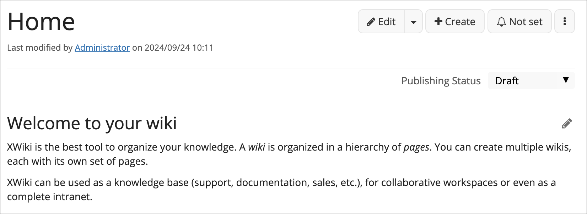
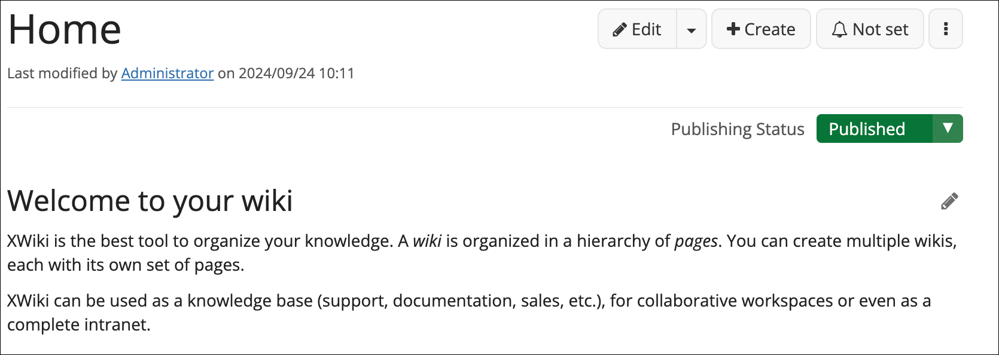

# Very Simple Status

This extension enables a status field on each document to provide a simple way of managing pages. A basic color code, based on Color Themes, is supported for each status.
The current supported statuses are; 
- Draft (standard button color)
- Published (success color)
- Archived (warning color)

## Screenshots

### Draft

### Published

### Archived

* Project Lead: [(name)](https://www.xwiki.org/xwiki/bin/view/XWiki/(profile id on xwiki.org))
* Documentation & Downloads: [Documentation & Download](https://extensions.xwiki.org/xwiki/bin/view/Extension/(extension name)))
* [Issue Tracker](https://jira.xwiki.org/browse/(jira id)
* Communication: [Forum](https://forum.xwiki.org/), [Chat](https://dev.xwiki.org/xwiki/bin/view/Community/Chat)
* [Development Practices](https://dev.xwiki.org)
* Minimal XWiki version supported: XWiki (minimal xwiki version)
* License: LGPL 2.1
* Translations: N/A
* Sonar Dashboard: [:(artifact id)&metric=alert_status)](https://sonarcloud.io/dashboard?id=(group id):(artifact id))
* Continuous Integration Status: [/job/master/badge/icon)](https://ci.xwiki.org/job/XWiki%20Contrib/job/(projct id on ci)/job/master/)
